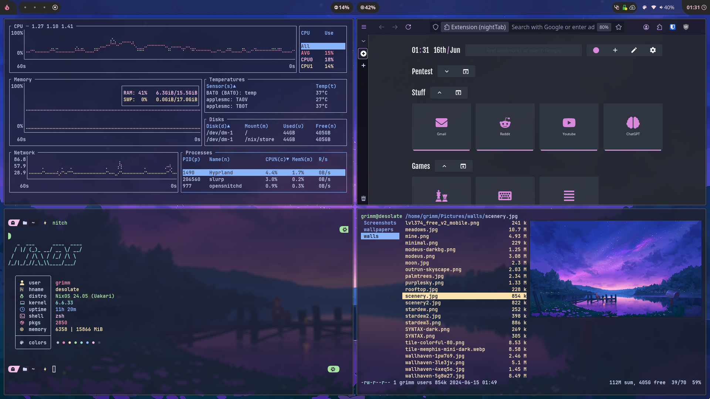
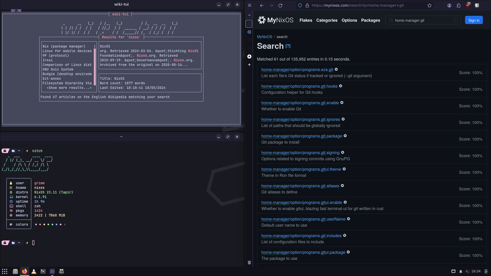

# Nix Dotfiles

## Hosts

will get updated over time

 - [desolate](./hosts/desolate) - 2017 13" macbook pro that I really only use during summer cuz fuck a desktop

## TODO

- [x] Get [nixvim](https://github.com/nix-community/nixvim) configured
- [ ] Move hyprland config to home-manager
- [ ] Move other .configs to home-manager
- [x] Setup encrypted install - (probably just gonna use the gui installer like a pleb)
- [x] add security with fail2ban, usbguard, firejail - (just stole shit from [NXM1's dotfiles](https://github.com/XNM1/linux-nixos-hyprland-config-dotfiles))
- [ ] move some personal scripts to Nixos following [vimjoyers vid](https://www.youtube.com/watch?v=diIh0P12arA) using `writeShellScriptBin`

## Acknowledgements

- [linuxmobile](https://github.com/linuxmobile/kaku) - always has amazing setups, can't help but take parts
- [NXM1](https://github.com/XNM1/linux-nixos-hyprland-config-dotfiles) - also an amazing setup but only took some of the security shit (didn't even properly set it up yet.)
- [sioodmy](https://github.com/sioodmy/dotfiles) - don't think i took anything, but why not ig? shoutout noboilerplate
